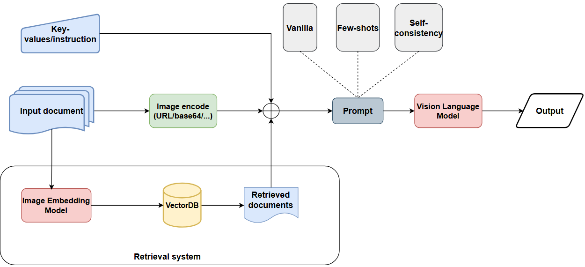

# Visual Document Understanding using Advanced Prompting Techniques

## **Descriptions**

This project aims to demonstrate the impact of different prompting strategies on the performance of Vision Language Models in Visual Document Understanding (VDU) tasks, with a focus on **Key Information Extraction** and **Table Extraction**. 

Three prompting techniques are examined and implemented: **Vanilla Prompting**, **Few-shot Prompting**, and **Self-consistency Prompting**. 

The two state-of-the-art Vision Language Models used in this project are **LLaMA Vision 11B** and **Qwen2 VL 72B**.

This project proposes an OCR-free approach to these VDU tasks by leveraging pretrained Vision Language Models and advanced prompting techniques.

## **How to run**

### **Required:**
- **Operating System**: Windows, Linux, MacOS
- **Python Environment**: version `>= 3.11`

### **Packages installation:**
1. Create virtual enviroment: `python -m venv <your_environment_name>`
2. Activate virtual environment:
    - On Windows, using Command Prompt: `.\<your_environment_name>\Scripts\activate`
    - On Linux/MacOS, using Bash: `source <your_environment_name>/bin/activate`
3. Install required packages: `pip install -r requirements.txt`

Replace `<your_environment_name>` with your actual virtual environment name.

### **Run inference on a image:**
Sample command to get evaluation on a image:

```
python -m scripts.infer --model llama_vision \
                        --image_path <your_image_path> \
                        --prompt_technique vanilla \
                        --extract_table False
```

Replace `<your_image_path>` with your actual image path. See more at [experiment variables](#experiment-variables)

### **Run experiments on a dataset:**
Sample command to get evaluation on a dataset:

```
python -m scripts.evaluate --model llama_vision \
                           --dataset <your_dataset_name> \
                           --prompt_technique self_consistency \
                           --base_prompt few_shots \
                           --extract_table True \
                           --num_samples 1 \
                           --retries 3
```

Replace `<your_dataset_name>` with your actual dataset name. See more at [experiment variables](#experiment-variables)

### Run evaluation with UI:
Run the app:
```
streamlit run app/main.py
```

## Documentations
### **Overview workflow:**



### Experiment variables

| Variable name | Meaning | List of values | Default value |
|----------|----------|----------| ---------- |
| `--model` | Model's name | - `llama_vision` (using LLaMA Vision 11B)<br>- `qwen_vision` (using Qwen2-VL 72B) | `llama_vision`  |
| `--dataset` | Dataset's name (Using when getting evaluation on a dataset) | **None** | **None** |
| `--image_path` | Path to the image (Using when running inference on a image) | **None** | **None** |
| `--prompt_technique` | Name of the prompting technique | - `vanilla` (for Vanilla Prompting)<br>- `few_shots` (for Few Shot Prompting)<br>- `self_consistency` (for Self-Consistency Prompting) | `vanilla` |
| `--base_prompt` | **(Optional)** Base prompting technique using for Self Consistency Prompting. Only need if `prompt_technique` is `self_consistency` | - `vanilla`<br>- `few_shots` | `vanilla` |
| `--extract_table` | Option to extract table or not | - `True` (do extract table)<br>- `False` (do not extract table) | `False` |
| `--num_samples` | **(Optional)** Number of samples using for Few Shots prompting. Only need if `prompt_technique` is `few_shots`  | **None** | **1** |
| `--retries` | **(Optional)** Number of parallel paths for Self-Consistency Prompting. Only need if `prompt_technique` is `self_consistency` | **None** | **3** |